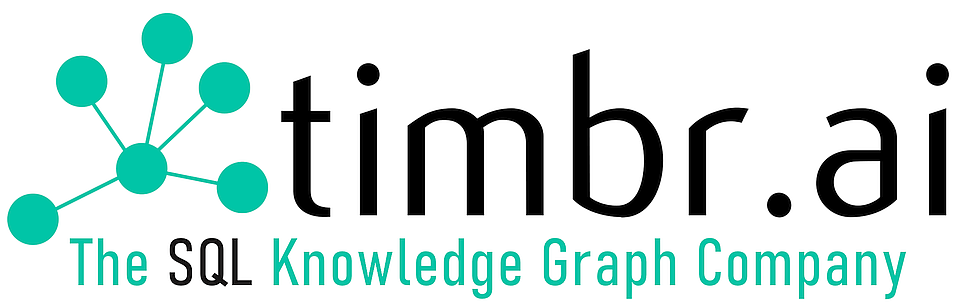

# Timbr Telecommunications Use Case Overview

The full Telecommunications Use Case can be found [here](http://telcom-tutorial.timbr.ai/#0). 

### DESCRIPTION
This Use case overview walks through the process of building a knowledge graph from scratch on a Telecommunications use case, helping explore, analyze and visualize data in different ways using the Timbr platform. 
The use case deals with different types of relationships and connections between different individuals and how to spot them. 

The topics that are covered in the use case include:

* Creating a virtual Knowledge Graph with hierarchies and business logic
* Mapping data from a sample database to the virtual Knowledge Graph
* Defining logical relationships between business concepts
* Using SQL statements to create the graph instantly
* Querying the Knowledge Graph using standard SQL to easily get advanced insights
* Exploring and discovering hidden relationships in the data using a graph explorer
* Creating a dashboard to represent the data with different visualizations

All use case samples are taken from [Timbr Environment](https://demo-env.timbr.ai/).

### Telecommunications Use Case ERD Model


This ERD model describes the entity types and relationships that exist between the entities used for this telecommunications use case. The relationships in this use case include:
* A one-to-many relationship between devices and people, representing devices owned by different people.
* Two one-to-many relationships between calls and people, representing both those who made calls to people and those who received calls from people. 
* Two one-to-many relationships between messages and people, representing both those who sent messages to people and those who received messages from people. 
* A one-to-many relationship between contracts and companies, representing the different information regarding company contracts.

### Telecommunications Ontology
Timbr’s Ontology Modeler provides a visual interface and a SQL DDL editor to easily model concepts and properties that represent the business or use-case.


### The Graph Data Explorer
Timbr’s Graph Data Explorer allows users to visualize the underlying data as a graph, to explore and discover relationships and dependencies in the data. The module enables traversing the entire organizational data so users can better understand the data, discover hidden value, visually find answers and expose the data without need of extracting tables or views before running a query.


### Semantic Queries in Timbr

Timbr's SQL Editor handles the process of creating, editing and running the semantically enabled SQL queries that require up to 90% less code than SQL queries without a knowledge graph.


### Querying without Timbr

```sql
SELECT `performed_communication[communication].communicated_with[person].entity_label`, COUNT(`performed_communication[communication].entity_id`) AS `number_of_communications`
FROM (SELECT `adult`.`entity_id`, `adult`.`entity_type`, `adult`.`entity_label`, `adult`.`phone_number`, `performed_communication[communication]`.`entity_id` AS `performed_communication[communication].entity_id`, `performed_communication[communication].communicated_with[person]`.`entity_label` AS `performed_communication[communication].communicated_with[person].entity_label`
            FROM (SELECT CAST(`person_id` AS CHAR) AS `entity_id`, 'person' AS `entity_type`, CONCAT(CAST(`first_name` AS CHAR), CONCAT(' ', CAST(`last_name` AS CHAR))) AS `entity_label`, `phone_number`
                        FROM (SELECT `city`, `last_name`, `phone_number`, `first_name`, `age`, `person_id`
                                    FROM (SELECT `age` AS `age`, `city` AS `city`, `first_name` AS `first_name`, `last_name` AS `last_name`, `person_id` AS `person_id`, `phone_number` AS `phone_number`
                                                FROM `calls`.`people`) AS `map_logic_map_person_1_13`) AS `map_logic_concept_map_person_1_14`
                        WHERE `age` >= 18) AS `adult`
                LEFT JOIN (SELECT `entity_id`, `entity_type`, `entity_label`, `to`
                        FROM (SELECT CAST(`call_id` AS CHAR) AS `entity_id`, 'call' AS `entity_type`, CAST(`call_id` AS CHAR) AS `entity_label`, `device_id`, `from`, `to`
                                            FROM (SELECT `call_duration` AS `call_duration`, `call_id` AS `call_id`, CAST(`started_at` AS DATETIME) AS `started_at`, `device_id` AS `device_id`, `caller_number` AS `from`, `callee_number` AS `to`
                                                        FROM `calls`.`calls`) AS `map_map_call_1_15`
                                        UNION ALL
                                            SELECT CAST(`message_id` AS CHAR) AS `entity_id`, 'message' AS `entity_type`, CAST(`message_id` AS CHAR) AS `entity_label`, `device_id`, `from`, `to`
                                            FROM (SELECT `date` AS `date`, `message` AS `message`, `message_id` AS `message_id`, `device_id` AS `device_id`, `sender` AS `from`, `receiver` AS `to`
                                                        FROM `calls`.`messages`) AS `map_map_message_1_16`) AS `map_union_communication_17`) AS `performed_communication[communication]` ON `adult`.`phone_number` = `performed_communication[communication]`.`to`
                LEFT JOIN (SELECT CAST(`person_id` AS CHAR) AS `entity_id`, 'person' AS `entity_type`, CONCAT(CAST(`first_name` AS CHAR), CONCAT(' ', CAST(`last_name` AS CHAR))) AS `entity_label`, `phone_number`
                        FROM (SELECT `age` AS `age`, `city` AS `city`, `first_name` AS `first_name`, `last_name` AS `last_name`, `person_id` AS `person_id`, `phone_number` AS `phone_number`
                                    FROM `calls`.`people`) AS `map_map_person_1_18`) AS `performed_communication[communication].communicated_with[person]` ON `performed_communication[communication]`.`to` = `performed_communication[communication].communicated_with[person]`.`phone_number`) AS `dtimbr_adult_1`
GROUP BY `performed_communication[communication].communicated_with[person].entity_label`
ORDER BY `number_of_communications` DESC
```
### Querying with Timbr 

```sql
select `performed_communication[communication].communicated_with[person].entity_label`, count(`performed_communication[communication].entity_id`) number_of_communications
from dtimbr.adult
group by  `performed_communication[communication].communicated_with[person].entity_label`
order by number_of_communications desc
```

### Querying without Timbr Vs. Querying with Timbr comparison


## FAQs & Contact Info

* [Timbr FAQs](https://timbr.ai/timbr-faqs/)  
* [Timbr Contact](https://timbr.ai/contact/)
