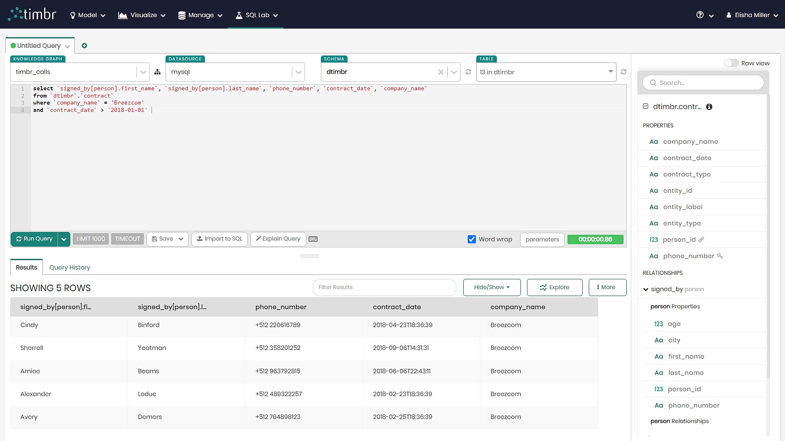

# Telecommunications Use Case SQL Scripts
Scripts in this folder are used for **querying** the Telecommunications knowledge graph.

## Scripts

| Script              | Description |
| ------------------- | ----------- |
| [telecommunication_query_1.sql](./telecommunication_query_1.sql) | First query of the data that finds the first and last name of any person who is age 18 and above who made a phone call and lives in the city of Metropolis. |
| [telecommunication_query_2.sql](./telecommunication_query_2.sql) | Second query of the data that also finds the first and last name of any person who is age 18 and above who made a phone call and lives in the city of Metropolis, however this time doing so with busniess logic. |
| [telecommunication_query_3.sql](./telecommunication_query_3.sql) | Third query of the data that finds the first and last name as well as the phone number of any person who made a cellular contract with a company called "Breezcom" from the beginning of 2018 and onwards. |
| [telecommunication_query_4.sql](./telecommunication_query_4.sql) | Fourth query of the data that finds the first and last name of any person who received a phone call from an adult as well as the number of calls they received. |
| [telecommunication_query_5.sql](./telecommunication_query_5.sql) | Fifth query of the data that finds the first and last name of any person who received a text message from an adult, as well as the number of messages they received. |
| [telecommunication_query_6.sql](./telecommunication_query_6.sql) | Sixth query of the data that finds the first and last name of any person who received any form of communication from an adult, whether it be a call, message or anything else that we defined as a communication. |
